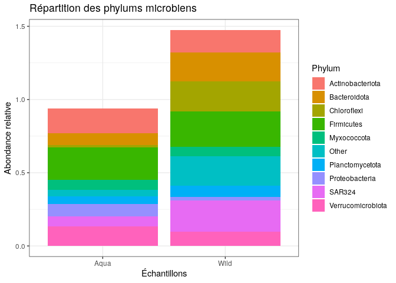
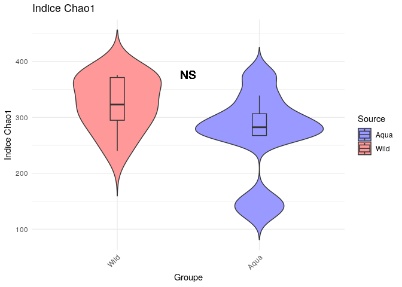

R Notebook
================

``` r
library(dada2)
```

    ## Loading required package: Rcpp

``` r
packageVersion("dada2")
```

    ## [1] '1.28.0'

``` r
path <- "/home/rstudio/octopuss/octuseq"
list.files(path)
```

    ##  [1] "filtered"               "SRR27048725_1.fastq.gz" "SRR27048725_2.fastq.gz"
    ##  [4] "SRR27048726_1.fastq.gz" "SRR27048726_2.fastq.gz" "SRR27048727_1.fastq.gz"
    ##  [7] "SRR27048727_2.fastq.gz" "SRR27048728_1.fastq.gz" "SRR27048728_2.fastq.gz"
    ## [10] "SRR27048729_1.fastq.gz" "SRR27048729_2.fastq.gz" "SRR27048730_1.fastq.gz"
    ## [13] "SRR27048730_2.fastq.gz" "SRR27048731_1.fastq.gz" "SRR27048731_2.fastq.gz"
    ## [16] "SRR27048732_1.fastq.gz" "SRR27048732_2.fastq.gz" "SRR27048733_1.fastq.gz"
    ## [19] "SRR27048733_2.fastq.gz" "SRR27048734_1.fastq.gz" "SRR27048734_2.fastq.gz"
    ## [22] "SRR27048735_1.fastq.gz" "SRR27048735_2.fastq.gz" "SRR27048736_1.fastq.gz"
    ## [25] "SRR27048736_2.fastq.gz" "SRR27048737_1.fastq.gz" "SRR27048737_2.fastq.gz"
    ## [28] "SRR27048738_1.fastq.gz" "SRR27048738_2.fastq.gz" "SRR27048739_1.fastq.gz"
    ## [31] "SRR27048739_2.fastq.gz" "SRR27048740_1.fastq.gz" "SRR27048740_2.fastq.gz"
    ## [34] "SRR27048741_1.fastq.gz" "SRR27048741_2.fastq.gz" "SRR27048742_1.fastq.gz"
    ## [37] "SRR27048742_2.fastq.gz" "SRR27048743_1.fastq.gz" "SRR27048743_2.fastq.gz"
    ## [40] "SRR27048744_1.fastq.gz" "SRR27048744_2.fastq.gz"

``` r
fnFs <- sort(list.files(path, pattern="_1.fastq.gz", full.names = TRUE))
fnRs <- sort(list.files(path, pattern="_2.fastq.gz", full.names = TRUE))
sample.names <- sapply(strsplit(basename(fnFs), "_"), `[`, 1)
```

``` r
plotQualityProfile(fnFs[1:2])
```

<!-- -->

``` r
plotQualityProfile(fnRs[1:2])
```

<!-- -->

``` r
filtFs <- file.path(path, "filtered", paste0(sample.names, "_F_filt.fastq.gz"))
filtRs <- file.path(path, "filtered", paste0(sample.names, "_R_filt.fastq.gz"))
names(filtFs) <- sample.names
names(filtRs) <- sample.names
```

``` r
out <- filterAndTrim(fnFs, filtFs, fnRs, filtRs, truncLen=c(280,180),
              maxN=0, maxEE=c(2,2), truncQ=2, rm.phix=TRUE,
              compress=TRUE, multithread=TRUE)
head(out)
```

    ##                        reads.in reads.out
    ## SRR27048725_1.fastq.gz   171483    123835
    ## SRR27048726_1.fastq.gz   174383    121800
    ## SRR27048727_1.fastq.gz   196532    139618
    ## SRR27048728_1.fastq.gz   137405     97986
    ## SRR27048729_1.fastq.gz   173365    121068
    ## SRR27048730_1.fastq.gz   152766    107900

``` r
errF <- learnErrors(filtFs, multithread=TRUE)
```

    ## 107870840 total bases in 385253 reads from 3 samples will be used for learning the error rates.

``` r
errR <- learnErrors(filtRs, multithread=TRUE)
```

    ## 108775260 total bases in 604307 reads from 5 samples will be used for learning the error rates.

``` r
plotErrors(errF, nominalQ=TRUE)
```

    ## Warning: Transformation introduced infinite values in continuous y-axis

<!-- -->

``` r
plotErrors(errR, nominalQ=TRUE)
```

    ## Warning: Transformation introduced infinite values in continuous y-axis
    ## Transformation introduced infinite values in continuous y-axis

<!-- -->

``` r
dadaFs <- dada(filtFs, err=errF, multithread=TRUE)
```

    ## Sample 1 - 123835 reads in 42920 unique sequences.
    ## Sample 2 - 121800 reads in 47867 unique sequences.
    ## Sample 3 - 139618 reads in 47139 unique sequences.
    ## Sample 4 - 97986 reads in 27992 unique sequences.
    ## Sample 5 - 121068 reads in 42382 unique sequences.
    ## Sample 6 - 107900 reads in 44245 unique sequences.
    ## Sample 7 - 88539 reads in 31325 unique sequences.
    ## Sample 8 - 99439 reads in 35545 unique sequences.
    ## Sample 9 - 93719 reads in 34929 unique sequences.
    ## Sample 10 - 107300 reads in 45507 unique sequences.
    ## Sample 11 - 111101 reads in 44235 unique sequences.
    ## Sample 12 - 116688 reads in 45569 unique sequences.
    ## Sample 13 - 92240 reads in 37209 unique sequences.
    ## Sample 14 - 90691 reads in 38571 unique sequences.
    ## Sample 15 - 96080 reads in 36402 unique sequences.
    ## Sample 16 - 115654 reads in 46861 unique sequences.
    ## Sample 17 - 112244 reads in 42979 unique sequences.
    ## Sample 18 - 111876 reads in 47264 unique sequences.
    ## Sample 19 - 119398 reads in 43737 unique sequences.
    ## Sample 20 - 99934 reads in 42320 unique sequences.

``` r
dadaRs <- dada(filtRs, err=errR, multithread=TRUE)
```

    ## Sample 1 - 123835 reads in 35474 unique sequences.
    ## Sample 2 - 121800 reads in 52177 unique sequences.
    ## Sample 3 - 139618 reads in 36035 unique sequences.
    ## Sample 4 - 97986 reads in 27088 unique sequences.
    ## Sample 5 - 121068 reads in 58574 unique sequences.
    ## Sample 6 - 107900 reads in 31482 unique sequences.
    ## Sample 7 - 88539 reads in 46514 unique sequences.
    ## Sample 8 - 99439 reads in 28908 unique sequences.
    ## Sample 9 - 93719 reads in 26050 unique sequences.
    ## Sample 10 - 107300 reads in 39498 unique sequences.
    ## Sample 11 - 111101 reads in 55591 unique sequences.
    ## Sample 12 - 116688 reads in 30665 unique sequences.
    ## Sample 13 - 92240 reads in 47258 unique sequences.
    ## Sample 14 - 90691 reads in 31647 unique sequences.
    ## Sample 15 - 96080 reads in 27016 unique sequences.
    ## Sample 16 - 115654 reads in 48455 unique sequences.
    ## Sample 17 - 112244 reads in 34591 unique sequences.
    ## Sample 18 - 111876 reads in 38046 unique sequences.
    ## Sample 19 - 119398 reads in 31225 unique sequences.
    ## Sample 20 - 99934 reads in 46784 unique sequences.

``` r
dadaFs[[1]]
```

    ## dada-class: object describing DADA2 denoising results
    ## 1102 sequence variants were inferred from 42920 input unique sequences.
    ## Key parameters: OMEGA_A = 1e-40, OMEGA_C = 1e-40, BAND_SIZE = 16

``` r
mergers <- mergePairs(dadaFs, filtFs, dadaRs, filtRs, verbose=TRUE)
```

    ## 13218 paired-reads (in 746 unique pairings) successfully merged out of 118633 (in 6548 pairings) input.

    ## 23482 paired-reads (in 922 unique pairings) successfully merged out of 115323 (in 6748 pairings) input.

    ## 28281 paired-reads (in 850 unique pairings) successfully merged out of 134627 (in 7035 pairings) input.

    ## 21141 paired-reads (in 236 unique pairings) successfully merged out of 95091 (in 2437 pairings) input.

    ## 29712 paired-reads (in 748 unique pairings) successfully merged out of 115554 (in 5310 pairings) input.

    ## 11721 paired-reads (in 677 unique pairings) successfully merged out of 101535 (in 6867 pairings) input.

    ## 21088 paired-reads (in 306 unique pairings) successfully merged out of 84045 (in 4150 pairings) input.

    ## 10277 paired-reads (in 796 unique pairings) successfully merged out of 95708 (in 5654 pairings) input.

    ## 9675 paired-reads (in 676 unique pairings) successfully merged out of 90168 (in 5393 pairings) input.

    ## 16731 paired-reads (in 1090 unique pairings) successfully merged out of 101296 (in 9007 pairings) input.

    ## 18260 paired-reads (in 1228 unique pairings) successfully merged out of 105130 (in 9344 pairings) input.

    ## 19298 paired-reads (in 1157 unique pairings) successfully merged out of 111425 (in 7639 pairings) input.

    ## 12939 paired-reads (in 850 unique pairings) successfully merged out of 87389 (in 6501 pairings) input.

    ## 16625 paired-reads (in 1049 unique pairings) successfully merged out of 85432 (in 7692 pairings) input.

    ## 10029 paired-reads (in 752 unique pairings) successfully merged out of 91894 (in 6154 pairings) input.

    ## 16903 paired-reads (in 1000 unique pairings) successfully merged out of 109999 (in 8048 pairings) input.

    ## 15484 paired-reads (in 1109 unique pairings) successfully merged out of 107952 (in 8737 pairings) input.

    ## 20031 paired-reads (in 1256 unique pairings) successfully merged out of 106297 (in 7625 pairings) input.

    ## 14305 paired-reads (in 907 unique pairings) successfully merged out of 114508 (in 8044 pairings) input.

    ## 17773 paired-reads (in 605 unique pairings) successfully merged out of 93928 (in 5689 pairings) input.

``` r
head(mergers[[1]])
```

    ##                                                                                                                                                                                                                                                                                                                                                                                                                                                         sequence
    ## 99      CCTACGGGTGGCAGCAGTGGGGAATATTGCACAATGGAGGGAACTCTGATGCAGCAACGCCGCGTGGAGGATGACACATTTCGGTGCGTAAACTCCTTTTATATGAGAAGATAATGACGGTATCATATGAATAAGCACCGGCTAACTCCGTGCCAGCAGCCGCGGTAATACGGGGGGTGCAAGCGTTACTCGGAATCACTGGGCGTAAAGAGCATGTAGGCTGGTTTGTAAGTTGGAAGTGAAATCCTATGGCTTAACCATAGAACTGCTTCCAAAACTGCAGACCTAGAATATGGGAGAGGTAGATGGAATTTCTGGTGTAGGGGTAAAATCCGTAGAGATCAGAAGGAATACCGATTGCGAAGGCGATCTACTGGAACATTATTGACGCTGAGATGCGAAAGCGTGGGGAGCAAACAGGATTAGATACCCTAGTAGTC
    ## 118     CCTACGGGTGGCAGCAGTGGGGAATATTGCACAATGGAGGGAACTCTGATGCAGCAACGCCGCGTGGAGGATGACACATTTCGGTGCGTAAACTCCTTTTATATGAGAAGATAATGACGGTATCATATGAATAAGCACCGGCTAACTCCGTGCCAGCAGCCGCGGTAATACGGGGGGTGCAAGCGTTACTCGGAATCACTGGGCGTAAAGAGCATGTAGGCTGGTTTGTAAGTTGGAAGTGAAATCCTATGGCTTAACCATAGAACTGCTTCCAAAACTGCAGACCTAGAATATGGGAGAGGTAGATGGAATTTCTGGTGTAGGGGTAAAATCCGTAGAGATCAGAAGGAATACCGATTGCGAAGGCGATCTACTGGAACATTATTGACGCTGAGATGCGAAAGCGTGGGGAGCAAACAGGATTAGATACCCCAGTAGTC
    ## 133     CCTACGGGTGGCAGCAGTGGGGAATCTTAGACAATGGGCGCAAGCCTGATCTAGCCATGCCGCGTGAGTGATGAAGGCCTTAGGGTCGTAAAGCTCTTTCGCCAGAGATGATAATGACAGTATCTGGTAAAGAAACCCCGGCTAACTCCGTGCCAGCAGCCGCGGTAATACGGAGGGGGTTAGCGTTGTTCGGAATTACTGGGCGTAAAGCGTACGTAGGCGGATTAGTCAGTTAGGGGTGAAATCCCAGGGCTCAACCCTGGAACTGCCCTTAATACTGCTAGTCTTGAGTTCGAGAGAGGTGAGTGGAATTCCGAGTGTAGAGGTGAAATTCGTAGATATTCGGAGGAACACCAGTGGCGAAGGCGGCTCACTGGCTCGATACTGACGCTGAGGTACGAAAGTGTGGGGAGCAAACAGGATTAGATACCCTAGTAGTC
    ## 155     CCTACGGGTGGCAGCAGTGGGGAATCTTGGACAATGGGCGCAAGCCTGATCCAGCCATGCCGCGTGAGTGATGAAGGCCCTAGGGTCGTAAAGCTCTTTCGCCAGAGATGATAATGACAGTATCTGGTAAAGAAACCCCGGCTAACTCCGTGCCAGCAGCCGCGGTAATACGGAGGGGGTTAGCGTTGTTCGGAATTACTGGGCGTAAAGCGCACGTAGGCGGATCAGAAAGTATAGGGTGAAATCCCAGGGCTCAACCCTGGAACTGCCTTATAAACTCCTGGTCTTGAGTTCGAGAGAGGTGAGTGGAATTCCGAGTGTAGAGGTGAAATTCGTAGATATTCGGAGGAACACCAGTGGCGAAGGCGGCTCACTGGCTCGATACTGACGCTGAGGTGCGAAAGTGTGGGGAGCAAACAGGATTAGATACCCCAGTAGTC
    ## 165     CCTACGGGTGGCAGCAGTGGGGAATATTGCACAATGGAGGGAACTCTGATGCAGCAACGCCGCGTGGAGGATGACACATTTCGGTGCGTAAACTCCTTTTATATGAGAAGATAATGACGGTATCATATGAATAAGCACCGGCTAACTCCGTGCCAGCAGCCGCGGTAATACGGGGGGTGCAAGCGTTACTCGGAATCACTGGGCGTAAAGAGCATGTAGGCTGGTTTGTAAGTTGGAAGTGAAATCCTATGGCTTAACCATAGAACTGCTTCCAAAACTGCAGACCTAGAATATGGGAGAGGTAGATGGAATTTCTGGTGTAGGGGTAAAATCCGTAGAGATCAGAAGGAATACCGATTGCGAAGGCGATCTACTGGAACATTATTGACGCTGAGATGCGAAAGCGTGGGGAGCAAACAGGATTAGATACCCTTGTAGTC
    ## 173 CCTACGGGTGGCTGCAGTCGAGAATCTTCCGCAATGCACGAAAGTGTGACGGAGCGACGCCGCGTGATGGATGAAGTATTTCGGTATGTAAACATCTTTTATAAGTGAAGAAGTATATTGACATTAACTTATGAATAAGGGGTTCCTAAACTCGTGCCAGCAGGAGCGGTAATACGAGTACCCCGAGCGTTATCCGGAATTATTGGGCGTAAAGGGTCCGTAGGTGGTTATATTAGTCTTTTGTGAAAGATCCAAGCTCAACTTGGGGACCGCAAAGGAAACGGTATAACTTGAGGGTGTGAGAGGTTAGTAGAACTCATGGTGTAGGGGTGAAATCCGTTGATATCATGGGGAATACCAAAAGCGAAGGCAACTAACTGGCACATTTCTGACACTGAGGGACGAAACCCTGGGTAGCGAATGGGATTAGATACCCTTGTAGTC
    ##     abundance forward reverse nmatch nmismatch nindel prefer accept
    ## 99        131      18      35     20         0      0      1   TRUE
    ## 118       120      18      42     20         0      0      1   TRUE
    ## 133       109     339     345     20         0      0      1   TRUE
    ## 155        99     163     378     20         0      0      1   TRUE
    ## 165        95      18      46     20         0      0      1   TRUE
    ## 173        93     158     157     16         0      0      1   TRUE

``` r
seqtab <- makeSequenceTable(mergers)
dim(seqtab)
```

    ## [1]   20 6770

``` r
table(nchar(getSequences(seqtab)))
```

    ## 
    ##  320  342  377  382  388  389  402  421  422  430  431  436  438  439  440  441 
    ##    1    4    1    2    1    1    1    1    2    5    1    1   11   18 5383  401 
    ##  442  443  444  445  446  447  448 
    ##  378  155  302   58   24   14    5

``` r
seqtab.nochim <- removeBimeraDenovo(seqtab, method="consensus", multithread=TRUE, verbose=TRUE)
```

    ## Identified 4095 bimeras out of 6770 input sequences.

``` r
dim(seqtab.nochim)
```

    ## [1]   20 2675

``` r
sum(seqtab.nochim)/sum(seqtab)
```

    ## [1] 0.6213913

``` r
getN <- function(x) sum(getUniques(x))
track <- cbind(out, sapply(dadaFs, getN), sapply(dadaRs, getN), sapply(mergers, getN), rowSums(seqtab.nochim))
colnames(track) <- c("input", "filtered", "denoisedF", "denoisedR", "merged", "nonchim")
rownames(track) <- sample.names
head(track)
```

    ##              input filtered denoisedF denoisedR merged nonchim
    ## SRR27048725 171483   123835    120329    121360  13218    7785
    ## SRR27048726 174383   121800    117407    118817  23482   15663
    ## SRR27048727 196532   139618    136118    137429  28281   18246
    ## SRR27048728 137405    97986     96027     96486  21141   14646
    ## SRR27048729 173365   121068    117363    118501  29712   20735
    ## SRR27048730 152766   107900    103640    104889  11721    8392

``` r
print(sample.names)
```

    ##  [1] "SRR27048725" "SRR27048726" "SRR27048727" "SRR27048728" "SRR27048729"
    ##  [6] "SRR27048730" "SRR27048731" "SRR27048732" "SRR27048733" "SRR27048734"
    ## [11] "SRR27048735" "SRR27048736" "SRR27048737" "SRR27048738" "SRR27048739"
    ## [16] "SRR27048740" "SRR27048741" "SRR27048742" "SRR27048743" "SRR27048744"

``` r
taxa <- assignTaxonomy(seqtab.nochim, "/home/rstudio/octopuss/silva_nr99_v138.1_train_set.fa.gz?download=1", multithread=TRUE)
```

``` r
taxa.print <- taxa # Removing sequence rownames for display only
rownames(taxa.print) <- NULL
head(taxa.print)
```

    ##      Kingdom    Phylum             Class             Order              
    ## [1,] "Bacteria" "Campylobacterota" "Campylobacteria" "Campylobacterales"
    ## [2,] "Bacteria" "Campylobacterota" "Campylobacteria" "Campylobacterales"
    ## [3,] "Bacteria" "Campylobacterota" "Campylobacteria" "Campylobacterales"
    ## [4,] "Bacteria" "Campylobacterota" "Campylobacteria" "Campylobacterales"
    ## [5,] "Bacteria" "Campylobacterota" "Campylobacteria" "Campylobacterales"
    ## [6,] "Bacteria" "Campylobacterota" "Campylobacteria" "Campylobacterales"
    ##      Family            Genus
    ## [1,] "Arcobacteraceae" NA   
    ## [2,] "Arcobacteraceae" NA   
    ## [3,] "Arcobacteraceae" NA   
    ## [4,] "Arcobacteraceae" NA   
    ## [5,] "Arcobacteraceae" NA   
    ## [6,] "Arcobacteraceae" NA

``` r
library(phyloseq); packageVersion("phyloseq")
```

    ## [1] '1.44.0'

``` r
library(Biostrings); packageVersion("Biostrings")
```

    ## Loading required package: BiocGenerics

    ## 
    ## Attaching package: 'BiocGenerics'

    ## The following objects are masked from 'package:stats':
    ## 
    ##     IQR, mad, sd, var, xtabs

    ## The following objects are masked from 'package:base':
    ## 
    ##     anyDuplicated, aperm, append, as.data.frame, basename, cbind,
    ##     colnames, dirname, do.call, duplicated, eval, evalq, Filter, Find,
    ##     get, grep, grepl, intersect, is.unsorted, lapply, Map, mapply,
    ##     match, mget, order, paste, pmax, pmax.int, pmin, pmin.int,
    ##     Position, rank, rbind, Reduce, rownames, sapply, setdiff, sort,
    ##     table, tapply, union, unique, unsplit, which.max, which.min

    ## Loading required package: S4Vectors

    ## Loading required package: stats4

    ## 
    ## Attaching package: 'S4Vectors'

    ## The following object is masked from 'package:utils':
    ## 
    ##     findMatches

    ## The following objects are masked from 'package:base':
    ## 
    ##     expand.grid, I, unname

    ## Loading required package: IRanges

    ## 
    ## Attaching package: 'IRanges'

    ## The following object is masked from 'package:phyloseq':
    ## 
    ##     distance

    ## Loading required package: XVector

    ## Loading required package: GenomeInfoDb

    ## 
    ## Attaching package: 'Biostrings'

    ## The following object is masked from 'package:base':
    ## 
    ##     strsplit

    ## [1] '2.68.1'

``` r
library(ggplot2); packageVersion("ggplot2")
```

    ## [1] '3.4.3'

``` r
theme_set(theme_bw())
```

``` r
donnesoctu <- read.csv("donnéesoctu.csv", sep = ",")
print(donnesoctu)
```

    ##     X         Run    BioSample  Experiment                  geo_loc_name X.1
    ## 1   1 SRR27048725 SAMN38525097 SRX22738376    Spain: O Grove, Pontevedra  NA
    ## 2   2 SRR27048726 SAMN38525096 SRX22738375    Spain: O Grove, Pontevedra  NA
    ## 3   3 SRR27048727 SAMN38525095 SRX22738374    Spain: O Grove, Pontevedra  NA
    ## 4   4 SRR27048728 SAMN38525094 SRX22738373    Spain: O Grove, Pontevedra  NA
    ## 5   5 SRR27048729 SAMN38525093 SRX22738372    Spain: O Grove, Pontevedra  NA
    ## 6   6 SRR27048730 SAMN38525092 SRX22738371    Spain: O Grove, Pontevedra  NA
    ## 7   7 SRR27048731 SAMN38525091 SRX22738370    Spain: O Grove, Pontevedra  NA
    ## 8   8 SRR27048732 SAMN38525090 SRX22738369    Spain: O Grove, Pontevedra  NA
    ## 9   9 SRR27048733 SAMN38525107 SRX22738368 Spain: Ra de Vigo, Pontevedra  NA
    ## 10 10 SRR27048734 SAMN38525106 SRX22738367 Spain: Ra de Vigo, Pontevedra  NA
    ## 11 11 SRR27048735 SAMN38525105 SRX22738366 Spain: Ra de Vigo, Pontevedra  NA
    ## 12 12 SRR27048736 SAMN38525104 SRX22738365 Spain: Ra de Vigo, Pontevedra  NA
    ## 13 13 SRR27048737 SAMN38525103 SRX22738364 Spain: Ra de Vigo, Pontevedra  NA
    ## 14 14 SRR27048738 SAMN38525102 SRX22738363 Spain: Ra de Vigo, Pontevedra  NA
    ## 15 15 SRR27048739 SAMN38525101 SRX22738362 Spain: Ra de Vigo, Pontevedra  NA
    ## 16 16 SRR27048740 SAMN38525100 SRX22738361 Spain: Ra de Vigo, Pontevedra  NA
    ## 17 17 SRR27048741 SAMN38525099 SRX22738360 Spain: Ra de Vigo, Pontevedra  NA
    ## 18 18 SRR27048742 SAMN38525098 SRX22738359 Spain: Ra de Vigo, Pontevedra  NA
    ## 19 19 SRR27048743 SAMN38525089 SRX22738358    Spain: O Grove, Pontevedra  NA
    ## 20 20 SRR27048744 SAMN38525088 SRX22738357    Spain: O Grove, Pontevedra  NA
    ##    Sample.Name source_material_id
    ## 1          A10      Aquaculture10
    ## 2           A9       Aquaculture9
    ## 3           A8       Aquaculture8
    ## 4           A7       Aquaculture7
    ## 5           A6       Aquaculture6
    ## 6           A5       Aquaculture5
    ## 7           A4       Aquaculture4
    ## 8           A3       Aquaculture3
    ## 9          W10             Wild10
    ## 10          W9              Wild9
    ## 11          W8              Wild8
    ## 12          W7              Wild7
    ## 13          W6              Wild6
    ## 14          W5              Wild5
    ## 15          W4              Wild4
    ## 16          W3              Wild3
    ## 17          W2              Wild2
    ## 18          W1              Wild1
    ## 19          A2       Aquaculture2
    ## 20          A1       Aquaculture1

``` r
# Chargement des données
donnesoctu <- read.csv("donnéesoctu.csv", sep = ",")

# Extraction des identifiants et de la culture
samples.out <- donnesoctu$Run
identifier <- substr(samples.out, 1, nchar(samples.out) - 1) 
culture <- substr(samples.out, nchar(samples.out), nchar(samples.out))

# Création du data frame des métadonnées
samdf <- data.frame(Identifier = identifier, Culture = culture, row.names = samples.out)

samdf <- data.frame(
  SampleName = rownames(seqtab.nochim),
  Source = c("Aqua", "Aqua", "Aqua", "Aqua", "Aqua", "Aqua", "Aqua", "Aqua", "Wild", "Wild", "Wild", "Wild", "Wild", "Wild", "Wild", "Wild", "Wild", "Wild", "Aqua", "Aqua" ) # Ajoutez les types dans l'ordre des échantillons
)
rownames(samdf) <- samdf$SampleName

# Vérification des dimensions
if (!all(rownames(samdf) %in% rownames(seqtab.nochim))) {
  stop("Les noms d'échantillons dans samdf ne correspondent pas à ceux de seqtab.nochim")
}

# Création de l'objet phyloseq
ps <- phyloseq(otu_table(seqtab.nochim, taxa_are_rows=FALSE), 
               sample_data(samdf), 
               tax_table(taxa))

# Vérification de l'objet phyloseq
print(ps)
```

    ## phyloseq-class experiment-level object
    ## otu_table()   OTU Table:         [ 2675 taxa and 20 samples ]
    ## sample_data() Sample Data:       [ 20 samples by 2 sample variables ]
    ## tax_table()   Taxonomy Table:    [ 2675 taxa by 6 taxonomic ranks ]

``` r
dna <- Biostrings::DNAStringSet(taxa_names(ps))
names(dna) <- taxa_names(ps)
ps <- merge_phyloseq(ps, dna)
taxa_names(ps) <- paste0("ASV", seq(ntaxa(ps)))
ps
```

    ## phyloseq-class experiment-level object
    ## otu_table()   OTU Table:         [ 2675 taxa and 20 samples ]
    ## sample_data() Sample Data:       [ 20 samples by 2 sample variables ]
    ## tax_table()   Taxonomy Table:    [ 2675 taxa by 6 taxonomic ranks ]
    ## refseq()      DNAStringSet:      [ 2675 reference sequences ]

``` r
plot_richness(ps, measures=c("Shannon", "Simpson"))
```

<!-- -->

``` r
ps.prop <- transform_sample_counts(ps, function(otu) otu/sum(otu))
ord.nmds.bray <- ordinate(ps.prop, method="NMDS", distance="bray")
```

    ## Run 0 stress 0.06274095 
    ## Run 1 stress 0.05697246 
    ## ... New best solution
    ## ... Procrustes: rmse 0.04243412  max resid 0.1350023 
    ## Run 2 stress 0.05651033 
    ## ... New best solution
    ## ... Procrustes: rmse 0.02458004  max resid 0.06346463 
    ## Run 3 stress 0.06290097 
    ## Run 4 stress 0.06261806 
    ## Run 5 stress 0.05639226 
    ## ... New best solution
    ## ... Procrustes: rmse 0.01829225  max resid 0.06459957 
    ## Run 6 stress 0.06299471 
    ## Run 7 stress 0.06275491 
    ## Run 8 stress 0.05664774 
    ## ... Procrustes: rmse 0.01109458  max resid 0.03181307 
    ## Run 9 stress 0.05720155 
    ## Run 10 stress 0.06291898 
    ## Run 11 stress 0.05646427 
    ## ... Procrustes: rmse 0.005479301  max resid 0.01723558 
    ## Run 12 stress 0.05767436 
    ## Run 13 stress 0.06379996 
    ## Run 14 stress 0.0629947 
    ## Run 15 stress 0.06285948 
    ## Run 16 stress 0.05746731 
    ## Run 17 stress 0.05695456 
    ## Run 18 stress 0.05664776 
    ## ... Procrustes: rmse 0.01109697  max resid 0.03181676 
    ## Run 19 stress 0.05664772 
    ## ... Procrustes: rmse 0.01108224  max resid 0.03182205 
    ## Run 20 stress 0.05699858 
    ## *** Best solution was not repeated -- monoMDS stopping criteria:
    ##      1: no. of iterations >= maxit
    ##     18: stress ratio > sratmax
    ##      1: scale factor of the gradient < sfgrmin

``` r
sum(is.na(otu_table(ps.prop)))
```

    ## [1] 0

``` r
str(ps.prop)
```

    ## Formal class 'phyloseq' [package "phyloseq"] with 5 slots
    ##   ..@ otu_table:Formal class 'otu_table' [package "phyloseq"] with 2 slots
    ##   .. .. ..@ .Data        : num [1:20, 1:2675] 0.00565 0.02547 0.05223 0.0736 0.04823 ...
    ##   .. .. .. ..- attr(*, "dimnames")=List of 2
    ##   .. .. .. .. ..$ : chr [1:20] "SRR27048725" "SRR27048726" "SRR27048727" "SRR27048728" ...
    ##   .. .. .. .. ..$ : chr [1:2675] "ASV1" "ASV2" "ASV3" "ASV4" ...
    ##   .. .. ..@ taxa_are_rows: logi FALSE
    ##   .. .. ..$ dim     : int [1:2] 20 2675
    ##   .. .. ..$ dimnames:List of 2
    ##   .. .. .. ..$ : chr [1:20] "SRR27048725" "SRR27048726" "SRR27048727" "SRR27048728" ...
    ##   .. .. .. ..$ : chr [1:2675] "ASV1" "ASV2" "ASV3" "ASV4" ...
    ##   ..@ tax_table:Formal class 'taxonomyTable' [package "phyloseq"] with 1 slot
    ##   .. .. ..@ .Data: chr [1:2675, 1:6] "Bacteria" "Bacteria" "Bacteria" "Bacteria" ...
    ##   .. .. .. ..- attr(*, "dimnames")=List of 2
    ##   .. .. .. .. ..$ : chr [1:2675] "ASV1" "ASV2" "ASV3" "ASV4" ...
    ##   .. .. .. .. ..$ : chr [1:6] "Kingdom" "Phylum" "Class" "Order" ...
    ##   .. .. ..$ dim     : int [1:2] 2675 6
    ##   .. .. ..$ dimnames:List of 2
    ##   .. .. .. ..$ : chr [1:2675] "ASV1" "ASV2" "ASV3" "ASV4" ...
    ##   .. .. .. ..$ : chr [1:6] "Kingdom" "Phylum" "Class" "Order" ...
    ##   ..@ sam_data :'data.frame':    20 obs. of  2 variables:
    ## Formal class 'sample_data' [package "phyloseq"] with 4 slots
    ##   .. .. ..@ .Data    :List of 2
    ##   .. .. .. ..$ : chr [1:20] "SRR27048725" "SRR27048726" "SRR27048727" "SRR27048728" ...
    ##   .. .. .. ..$ : chr [1:20] "Aqua" "Aqua" "Aqua" "Aqua" ...
    ##   .. .. ..@ names    : chr [1:2] "SampleName" "Source"
    ##   .. .. ..@ row.names: chr [1:20] "SRR27048725" "SRR27048726" "SRR27048727" "SRR27048728" ...
    ##   .. .. ..@ .S3Class : chr "data.frame"
    ##   ..@ phy_tree : NULL
    ##   ..@ refseq   :Formal class 'DNAStringSet' [package "Biostrings"] with 5 slots
    ##   .. .. ..@ pool           :Formal class 'SharedRaw_Pool' [package "XVector"] with 2 slots
    ##   .. .. .. .. ..@ xp_list                    :List of 1
    ##   .. .. .. .. .. ..$ :<externalptr> 
    ##   .. .. .. .. ..@ .link_to_cached_object_list:List of 1
    ##   .. .. .. .. .. ..$ :<environment: 0x5594513e7390> 
    ##   .. .. ..@ ranges         :Formal class 'GroupedIRanges' [package "XVector"] with 7 slots
    ##   .. .. .. .. ..@ group          : int [1:2675] 1 1 1 1 1 1 1 1 1 1 ...
    ##   .. .. .. .. ..@ start          : int [1:2675] 1 441 881 1321 1761 2201 2641 3081 3521 3961 ...
    ##   .. .. .. .. ..@ width          : int [1:2675] 440 440 440 440 440 440 440 440 440 440 ...
    ##   .. .. .. .. ..@ NAMES          : chr [1:2675] "ASV1" "ASV2" "ASV3" "ASV4" ...
    ##   .. .. .. .. ..@ elementType    : chr "ANY"
    ##   .. .. .. .. ..@ elementMetadata: NULL
    ##   .. .. .. .. ..@ metadata       : list()
    ##   .. .. ..@ elementType    : chr "DNAString"
    ##   .. .. ..@ elementMetadata: NULL
    ##   .. .. ..@ metadata       : list()

``` r
ps.prop <- subset_samples(ps.prop, !is.na(otu_table(ps.prop)))
otu_table(ps.prop)[is.na(otu_table(ps.prop))] <- rowMeans(otu_table(ps.prop), na.rm = TRUE)
```

``` r
ord.nmds.bray <- ordinate(ps.prop, method = "NMDS", distance = "bray")
```

    ## Run 0 stress 0.06274095 
    ## Run 1 stress 0.06279899 
    ## ... Procrustes: rmse 0.01247477  max resid 0.03268066 
    ## Run 2 stress 0.05664775 
    ## ... New best solution
    ## ... Procrustes: rmse 0.04428436  max resid 0.1362264 
    ## Run 3 stress 0.06290849 
    ## Run 4 stress 0.05639219 
    ## ... New best solution
    ## ... Procrustes: rmse 0.01105424  max resid 0.03161863 
    ## Run 5 stress 0.06290248 
    ## Run 6 stress 0.05646423 
    ## ... Procrustes: rmse 0.005455272  max resid 0.01726411 
    ## Run 7 stress 0.0566478 
    ## ... Procrustes: rmse 0.01104875  max resid 0.03161612 
    ## Run 8 stress 0.0570373 
    ## Run 9 stress 0.05686702 
    ## ... Procrustes: rmse 0.01215363  max resid 0.04915482 
    ## Run 10 stress 0.05683547 
    ## ... Procrustes: rmse 0.01969661  max resid 0.06431392 
    ## Run 11 stress 0.05652209 
    ## ... Procrustes: rmse 0.01054061  max resid 0.03102557 
    ## Run 12 stress 0.0625627 
    ## Run 13 stress 0.05703731 
    ## Run 14 stress 0.05720155 
    ## Run 15 stress 0.06274362 
    ## Run 16 stress 0.0631431 
    ## Run 17 stress 0.05720157 
    ## Run 18 stress 0.05703732 
    ## Run 19 stress 0.05683546 
    ## ... Procrustes: rmse 0.01968339  max resid 0.06427322 
    ## Run 20 stress 0.05639218 
    ## ... New best solution
    ## ... Procrustes: rmse 2.299219e-05  max resid 6.362423e-05 
    ## ... Similar to previous best
    ## *** Best solution repeated 1 times

``` r
plot_ordination(ps.prop, ord.nmds.bray, title="Bray NMDS")
```

<!-- -->

``` r
top20 <- names(sort(taxa_sums(ps), decreasing=TRUE))[1:3000]
ps.top20 <- transform_sample_counts(ps, function(OTU) OTU/sum(OTU))
ps.top20 <- prune_taxa(top20, ps.top20)
plot_bar(ps.top20, fill = "Phylum") + facet_wrap(~Source, scales="free_x")
```

<!-- -->

``` r
theme_bw()
```

    ## List of 97
    ##  $ line                      :List of 6
    ##   ..$ colour       : chr "black"
    ##   ..$ linewidth    : num 0.5
    ##   ..$ linetype     : num 1
    ##   ..$ lineend      : chr "butt"
    ##   ..$ arrow        : logi FALSE
    ##   ..$ inherit.blank: logi TRUE
    ##   ..- attr(*, "class")= chr [1:2] "element_line" "element"
    ##  $ rect                      :List of 5
    ##   ..$ fill         : chr "white"
    ##   ..$ colour       : chr "black"
    ##   ..$ linewidth    : num 0.5
    ##   ..$ linetype     : num 1
    ##   ..$ inherit.blank: logi TRUE
    ##   ..- attr(*, "class")= chr [1:2] "element_rect" "element"
    ##  $ text                      :List of 11
    ##   ..$ family       : chr ""
    ##   ..$ face         : chr "plain"
    ##   ..$ colour       : chr "black"
    ##   ..$ size         : num 11
    ##   ..$ hjust        : num 0.5
    ##   ..$ vjust        : num 0.5
    ##   ..$ angle        : num 0
    ##   ..$ lineheight   : num 0.9
    ##   ..$ margin       : 'margin' num [1:4] 0points 0points 0points 0points
    ##   .. ..- attr(*, "unit")= int 8
    ##   ..$ debug        : logi FALSE
    ##   ..$ inherit.blank: logi TRUE
    ##   ..- attr(*, "class")= chr [1:2] "element_text" "element"
    ##  $ title                     : NULL
    ##  $ aspect.ratio              : NULL
    ##  $ axis.title                : NULL
    ##  $ axis.title.x              :List of 11
    ##   ..$ family       : NULL
    ##   ..$ face         : NULL
    ##   ..$ colour       : NULL
    ##   ..$ size         : NULL
    ##   ..$ hjust        : NULL
    ##   ..$ vjust        : num 1
    ##   ..$ angle        : NULL
    ##   ..$ lineheight   : NULL
    ##   ..$ margin       : 'margin' num [1:4] 2.75points 0points 0points 0points
    ##   .. ..- attr(*, "unit")= int 8
    ##   ..$ debug        : NULL
    ##   ..$ inherit.blank: logi TRUE
    ##   ..- attr(*, "class")= chr [1:2] "element_text" "element"
    ##  $ axis.title.x.top          :List of 11
    ##   ..$ family       : NULL
    ##   ..$ face         : NULL
    ##   ..$ colour       : NULL
    ##   ..$ size         : NULL
    ##   ..$ hjust        : NULL
    ##   ..$ vjust        : num 0
    ##   ..$ angle        : NULL
    ##   ..$ lineheight   : NULL
    ##   ..$ margin       : 'margin' num [1:4] 0points 0points 2.75points 0points
    ##   .. ..- attr(*, "unit")= int 8
    ##   ..$ debug        : NULL
    ##   ..$ inherit.blank: logi TRUE
    ##   ..- attr(*, "class")= chr [1:2] "element_text" "element"
    ##  $ axis.title.x.bottom       : NULL
    ##  $ axis.title.y              :List of 11
    ##   ..$ family       : NULL
    ##   ..$ face         : NULL
    ##   ..$ colour       : NULL
    ##   ..$ size         : NULL
    ##   ..$ hjust        : NULL
    ##   ..$ vjust        : num 1
    ##   ..$ angle        : num 90
    ##   ..$ lineheight   : NULL
    ##   ..$ margin       : 'margin' num [1:4] 0points 2.75points 0points 0points
    ##   .. ..- attr(*, "unit")= int 8
    ##   ..$ debug        : NULL
    ##   ..$ inherit.blank: logi TRUE
    ##   ..- attr(*, "class")= chr [1:2] "element_text" "element"
    ##  $ axis.title.y.left         : NULL
    ##  $ axis.title.y.right        :List of 11
    ##   ..$ family       : NULL
    ##   ..$ face         : NULL
    ##   ..$ colour       : NULL
    ##   ..$ size         : NULL
    ##   ..$ hjust        : NULL
    ##   ..$ vjust        : num 0
    ##   ..$ angle        : num -90
    ##   ..$ lineheight   : NULL
    ##   ..$ margin       : 'margin' num [1:4] 0points 0points 0points 2.75points
    ##   .. ..- attr(*, "unit")= int 8
    ##   ..$ debug        : NULL
    ##   ..$ inherit.blank: logi TRUE
    ##   ..- attr(*, "class")= chr [1:2] "element_text" "element"
    ##  $ axis.text                 :List of 11
    ##   ..$ family       : NULL
    ##   ..$ face         : NULL
    ##   ..$ colour       : chr "grey30"
    ##   ..$ size         : 'rel' num 0.8
    ##   ..$ hjust        : NULL
    ##   ..$ vjust        : NULL
    ##   ..$ angle        : NULL
    ##   ..$ lineheight   : NULL
    ##   ..$ margin       : NULL
    ##   ..$ debug        : NULL
    ##   ..$ inherit.blank: logi TRUE
    ##   ..- attr(*, "class")= chr [1:2] "element_text" "element"
    ##  $ axis.text.x               :List of 11
    ##   ..$ family       : NULL
    ##   ..$ face         : NULL
    ##   ..$ colour       : NULL
    ##   ..$ size         : NULL
    ##   ..$ hjust        : NULL
    ##   ..$ vjust        : num 1
    ##   ..$ angle        : NULL
    ##   ..$ lineheight   : NULL
    ##   ..$ margin       : 'margin' num [1:4] 2.2points 0points 0points 0points
    ##   .. ..- attr(*, "unit")= int 8
    ##   ..$ debug        : NULL
    ##   ..$ inherit.blank: logi TRUE
    ##   ..- attr(*, "class")= chr [1:2] "element_text" "element"
    ##  $ axis.text.x.top           :List of 11
    ##   ..$ family       : NULL
    ##   ..$ face         : NULL
    ##   ..$ colour       : NULL
    ##   ..$ size         : NULL
    ##   ..$ hjust        : NULL
    ##   ..$ vjust        : num 0
    ##   ..$ angle        : NULL
    ##   ..$ lineheight   : NULL
    ##   ..$ margin       : 'margin' num [1:4] 0points 0points 2.2points 0points
    ##   .. ..- attr(*, "unit")= int 8
    ##   ..$ debug        : NULL
    ##   ..$ inherit.blank: logi TRUE
    ##   ..- attr(*, "class")= chr [1:2] "element_text" "element"
    ##  $ axis.text.x.bottom        : NULL
    ##  $ axis.text.y               :List of 11
    ##   ..$ family       : NULL
    ##   ..$ face         : NULL
    ##   ..$ colour       : NULL
    ##   ..$ size         : NULL
    ##   ..$ hjust        : num 1
    ##   ..$ vjust        : NULL
    ##   ..$ angle        : NULL
    ##   ..$ lineheight   : NULL
    ##   ..$ margin       : 'margin' num [1:4] 0points 2.2points 0points 0points
    ##   .. ..- attr(*, "unit")= int 8
    ##   ..$ debug        : NULL
    ##   ..$ inherit.blank: logi TRUE
    ##   ..- attr(*, "class")= chr [1:2] "element_text" "element"
    ##  $ axis.text.y.left          : NULL
    ##  $ axis.text.y.right         :List of 11
    ##   ..$ family       : NULL
    ##   ..$ face         : NULL
    ##   ..$ colour       : NULL
    ##   ..$ size         : NULL
    ##   ..$ hjust        : num 0
    ##   ..$ vjust        : NULL
    ##   ..$ angle        : NULL
    ##   ..$ lineheight   : NULL
    ##   ..$ margin       : 'margin' num [1:4] 0points 0points 0points 2.2points
    ##   .. ..- attr(*, "unit")= int 8
    ##   ..$ debug        : NULL
    ##   ..$ inherit.blank: logi TRUE
    ##   ..- attr(*, "class")= chr [1:2] "element_text" "element"
    ##  $ axis.ticks                :List of 6
    ##   ..$ colour       : chr "grey20"
    ##   ..$ linewidth    : NULL
    ##   ..$ linetype     : NULL
    ##   ..$ lineend      : NULL
    ##   ..$ arrow        : logi FALSE
    ##   ..$ inherit.blank: logi TRUE
    ##   ..- attr(*, "class")= chr [1:2] "element_line" "element"
    ##  $ axis.ticks.x              : NULL
    ##  $ axis.ticks.x.top          : NULL
    ##  $ axis.ticks.x.bottom       : NULL
    ##  $ axis.ticks.y              : NULL
    ##  $ axis.ticks.y.left         : NULL
    ##  $ axis.ticks.y.right        : NULL
    ##  $ axis.ticks.length         : 'simpleUnit' num 2.75points
    ##   ..- attr(*, "unit")= int 8
    ##  $ axis.ticks.length.x       : NULL
    ##  $ axis.ticks.length.x.top   : NULL
    ##  $ axis.ticks.length.x.bottom: NULL
    ##  $ axis.ticks.length.y       : NULL
    ##  $ axis.ticks.length.y.left  : NULL
    ##  $ axis.ticks.length.y.right : NULL
    ##  $ axis.line                 : list()
    ##   ..- attr(*, "class")= chr [1:2] "element_blank" "element"
    ##  $ axis.line.x               : NULL
    ##  $ axis.line.x.top           : NULL
    ##  $ axis.line.x.bottom        : NULL
    ##  $ axis.line.y               : NULL
    ##  $ axis.line.y.left          : NULL
    ##  $ axis.line.y.right         : NULL
    ##  $ legend.background         :List of 5
    ##   ..$ fill         : NULL
    ##   ..$ colour       : logi NA
    ##   ..$ linewidth    : NULL
    ##   ..$ linetype     : NULL
    ##   ..$ inherit.blank: logi TRUE
    ##   ..- attr(*, "class")= chr [1:2] "element_rect" "element"
    ##  $ legend.margin             : 'margin' num [1:4] 5.5points 5.5points 5.5points 5.5points
    ##   ..- attr(*, "unit")= int 8
    ##  $ legend.spacing            : 'simpleUnit' num 11points
    ##   ..- attr(*, "unit")= int 8
    ##  $ legend.spacing.x          : NULL
    ##  $ legend.spacing.y          : NULL
    ##  $ legend.key                :List of 5
    ##   ..$ fill         : chr "white"
    ##   ..$ colour       : logi NA
    ##   ..$ linewidth    : NULL
    ##   ..$ linetype     : NULL
    ##   ..$ inherit.blank: logi TRUE
    ##   ..- attr(*, "class")= chr [1:2] "element_rect" "element"
    ##  $ legend.key.size           : 'simpleUnit' num 1.2lines
    ##   ..- attr(*, "unit")= int 3
    ##  $ legend.key.height         : NULL
    ##  $ legend.key.width          : NULL
    ##  $ legend.text               :List of 11
    ##   ..$ family       : NULL
    ##   ..$ face         : NULL
    ##   ..$ colour       : NULL
    ##   ..$ size         : 'rel' num 0.8
    ##   ..$ hjust        : NULL
    ##   ..$ vjust        : NULL
    ##   ..$ angle        : NULL
    ##   ..$ lineheight   : NULL
    ##   ..$ margin       : NULL
    ##   ..$ debug        : NULL
    ##   ..$ inherit.blank: logi TRUE
    ##   ..- attr(*, "class")= chr [1:2] "element_text" "element"
    ##  $ legend.text.align         : NULL
    ##  $ legend.title              :List of 11
    ##   ..$ family       : NULL
    ##   ..$ face         : NULL
    ##   ..$ colour       : NULL
    ##   ..$ size         : NULL
    ##   ..$ hjust        : num 0
    ##   ..$ vjust        : NULL
    ##   ..$ angle        : NULL
    ##   ..$ lineheight   : NULL
    ##   ..$ margin       : NULL
    ##   ..$ debug        : NULL
    ##   ..$ inherit.blank: logi TRUE
    ##   ..- attr(*, "class")= chr [1:2] "element_text" "element"
    ##  $ legend.title.align        : NULL
    ##  $ legend.position           : chr "right"
    ##  $ legend.direction          : NULL
    ##  $ legend.justification      : chr "center"
    ##  $ legend.box                : NULL
    ##  $ legend.box.just           : NULL
    ##  $ legend.box.margin         : 'margin' num [1:4] 0cm 0cm 0cm 0cm
    ##   ..- attr(*, "unit")= int 1
    ##  $ legend.box.background     : list()
    ##   ..- attr(*, "class")= chr [1:2] "element_blank" "element"
    ##  $ legend.box.spacing        : 'simpleUnit' num 11points
    ##   ..- attr(*, "unit")= int 8
    ##  $ panel.background          :List of 5
    ##   ..$ fill         : chr "white"
    ##   ..$ colour       : logi NA
    ##   ..$ linewidth    : NULL
    ##   ..$ linetype     : NULL
    ##   ..$ inherit.blank: logi TRUE
    ##   ..- attr(*, "class")= chr [1:2] "element_rect" "element"
    ##  $ panel.border              :List of 5
    ##   ..$ fill         : logi NA
    ##   ..$ colour       : chr "grey20"
    ##   ..$ linewidth    : NULL
    ##   ..$ linetype     : NULL
    ##   ..$ inherit.blank: logi TRUE
    ##   ..- attr(*, "class")= chr [1:2] "element_rect" "element"
    ##  $ panel.spacing             : 'simpleUnit' num 5.5points
    ##   ..- attr(*, "unit")= int 8
    ##  $ panel.spacing.x           : NULL
    ##  $ panel.spacing.y           : NULL
    ##  $ panel.grid                :List of 6
    ##   ..$ colour       : chr "grey92"
    ##   ..$ linewidth    : NULL
    ##   ..$ linetype     : NULL
    ##   ..$ lineend      : NULL
    ##   ..$ arrow        : logi FALSE
    ##   ..$ inherit.blank: logi TRUE
    ##   ..- attr(*, "class")= chr [1:2] "element_line" "element"
    ##  $ panel.grid.major          : NULL
    ##  $ panel.grid.minor          :List of 6
    ##   ..$ colour       : NULL
    ##   ..$ linewidth    : 'rel' num 0.5
    ##   ..$ linetype     : NULL
    ##   ..$ lineend      : NULL
    ##   ..$ arrow        : logi FALSE
    ##   ..$ inherit.blank: logi TRUE
    ##   ..- attr(*, "class")= chr [1:2] "element_line" "element"
    ##  $ panel.grid.major.x        : NULL
    ##  $ panel.grid.major.y        : NULL
    ##  $ panel.grid.minor.x        : NULL
    ##  $ panel.grid.minor.y        : NULL
    ##  $ panel.ontop               : logi FALSE
    ##  $ plot.background           :List of 5
    ##   ..$ fill         : NULL
    ##   ..$ colour       : chr "white"
    ##   ..$ linewidth    : NULL
    ##   ..$ linetype     : NULL
    ##   ..$ inherit.blank: logi TRUE
    ##   ..- attr(*, "class")= chr [1:2] "element_rect" "element"
    ##  $ plot.title                :List of 11
    ##   ..$ family       : NULL
    ##   ..$ face         : NULL
    ##   ..$ colour       : NULL
    ##   ..$ size         : 'rel' num 1.2
    ##   ..$ hjust        : num 0
    ##   ..$ vjust        : num 1
    ##   ..$ angle        : NULL
    ##   ..$ lineheight   : NULL
    ##   ..$ margin       : 'margin' num [1:4] 0points 0points 5.5points 0points
    ##   .. ..- attr(*, "unit")= int 8
    ##   ..$ debug        : NULL
    ##   ..$ inherit.blank: logi TRUE
    ##   ..- attr(*, "class")= chr [1:2] "element_text" "element"
    ##  $ plot.title.position       : chr "panel"
    ##  $ plot.subtitle             :List of 11
    ##   ..$ family       : NULL
    ##   ..$ face         : NULL
    ##   ..$ colour       : NULL
    ##   ..$ size         : NULL
    ##   ..$ hjust        : num 0
    ##   ..$ vjust        : num 1
    ##   ..$ angle        : NULL
    ##   ..$ lineheight   : NULL
    ##   ..$ margin       : 'margin' num [1:4] 0points 0points 5.5points 0points
    ##   .. ..- attr(*, "unit")= int 8
    ##   ..$ debug        : NULL
    ##   ..$ inherit.blank: logi TRUE
    ##   ..- attr(*, "class")= chr [1:2] "element_text" "element"
    ##  $ plot.caption              :List of 11
    ##   ..$ family       : NULL
    ##   ..$ face         : NULL
    ##   ..$ colour       : NULL
    ##   ..$ size         : 'rel' num 0.8
    ##   ..$ hjust        : num 1
    ##   ..$ vjust        : num 1
    ##   ..$ angle        : NULL
    ##   ..$ lineheight   : NULL
    ##   ..$ margin       : 'margin' num [1:4] 5.5points 0points 0points 0points
    ##   .. ..- attr(*, "unit")= int 8
    ##   ..$ debug        : NULL
    ##   ..$ inherit.blank: logi TRUE
    ##   ..- attr(*, "class")= chr [1:2] "element_text" "element"
    ##  $ plot.caption.position     : chr "panel"
    ##  $ plot.tag                  :List of 11
    ##   ..$ family       : NULL
    ##   ..$ face         : NULL
    ##   ..$ colour       : NULL
    ##   ..$ size         : 'rel' num 1.2
    ##   ..$ hjust        : num 0.5
    ##   ..$ vjust        : num 0.5
    ##   ..$ angle        : NULL
    ##   ..$ lineheight   : NULL
    ##   ..$ margin       : NULL
    ##   ..$ debug        : NULL
    ##   ..$ inherit.blank: logi TRUE
    ##   ..- attr(*, "class")= chr [1:2] "element_text" "element"
    ##  $ plot.tag.position         : chr "topleft"
    ##  $ plot.margin               : 'margin' num [1:4] 5.5points 5.5points 5.5points 5.5points
    ##   ..- attr(*, "unit")= int 8
    ##  $ strip.background          :List of 5
    ##   ..$ fill         : chr "grey85"
    ##   ..$ colour       : chr "grey20"
    ##   ..$ linewidth    : NULL
    ##   ..$ linetype     : NULL
    ##   ..$ inherit.blank: logi TRUE
    ##   ..- attr(*, "class")= chr [1:2] "element_rect" "element"
    ##  $ strip.background.x        : NULL
    ##  $ strip.background.y        : NULL
    ##  $ strip.clip                : chr "inherit"
    ##  $ strip.placement           : chr "inside"
    ##  $ strip.text                :List of 11
    ##   ..$ family       : NULL
    ##   ..$ face         : NULL
    ##   ..$ colour       : chr "grey10"
    ##   ..$ size         : 'rel' num 0.8
    ##   ..$ hjust        : NULL
    ##   ..$ vjust        : NULL
    ##   ..$ angle        : NULL
    ##   ..$ lineheight   : NULL
    ##   ..$ margin       : 'margin' num [1:4] 4.4points 4.4points 4.4points 4.4points
    ##   .. ..- attr(*, "unit")= int 8
    ##   ..$ debug        : NULL
    ##   ..$ inherit.blank: logi TRUE
    ##   ..- attr(*, "class")= chr [1:2] "element_text" "element"
    ##  $ strip.text.x              : NULL
    ##  $ strip.text.x.bottom       : NULL
    ##  $ strip.text.x.top          : NULL
    ##  $ strip.text.y              :List of 11
    ##   ..$ family       : NULL
    ##   ..$ face         : NULL
    ##   ..$ colour       : NULL
    ##   ..$ size         : NULL
    ##   ..$ hjust        : NULL
    ##   ..$ vjust        : NULL
    ##   ..$ angle        : num -90
    ##   ..$ lineheight   : NULL
    ##   ..$ margin       : NULL
    ##   ..$ debug        : NULL
    ##   ..$ inherit.blank: logi TRUE
    ##   ..- attr(*, "class")= chr [1:2] "element_text" "element"
    ##  $ strip.text.y.left         :List of 11
    ##   ..$ family       : NULL
    ##   ..$ face         : NULL
    ##   ..$ colour       : NULL
    ##   ..$ size         : NULL
    ##   ..$ hjust        : NULL
    ##   ..$ vjust        : NULL
    ##   ..$ angle        : num 90
    ##   ..$ lineheight   : NULL
    ##   ..$ margin       : NULL
    ##   ..$ debug        : NULL
    ##   ..$ inherit.blank: logi TRUE
    ##   ..- attr(*, "class")= chr [1:2] "element_text" "element"
    ##  $ strip.text.y.right        : NULL
    ##  $ strip.switch.pad.grid     : 'simpleUnit' num 2.75points
    ##   ..- attr(*, "unit")= int 8
    ##  $ strip.switch.pad.wrap     : 'simpleUnit' num 2.75points
    ##   ..- attr(*, "unit")= int 8
    ##  - attr(*, "class")= chr [1:2] "theme" "gg"
    ##  - attr(*, "complete")= logi TRUE
    ##  - attr(*, "validate")= logi TRUE

``` r
# Charger la bibliothèque nécessaire
library(ggplot2)

# Exemple de données
data <- data.frame(
  Sample = rep(c("Aqua", "Wild"), each = 10),
  Phylum = rep(c("Proteobacteria", "Bacteroidota", "Firmicutes", "Actinobacteriota",
                 "Chloroflexi", "Verrucomicrobiota", "Planctomycetota", "Myxococcota", 
                 "SAR324", "Other"), 2),
  Abundance = c(runif(10, 0.01, 0.25), runif(10, 0.01, 0.25))
)

# Créer le graphique avec un fond blanc
ggplot(data, aes(x = Sample, y = Abundance, fill = Phylum)) +
  geom_bar(stat = "identity", position = "stack") +  # Barres empilées
  labs(
    title = "Répartition des phylums microbiens",
    x = "Échantillons",
    y = "Abondance relative"
  ) +
  theme_bw()  # Thème avec fond blanc
```

<!-- -->

``` r
library(ggplot2)
library(viridis)  # Charger une palette de couleurs harmonieuse
```

    ## Loading required package: viridisLite

``` r
# Visualisation améliorée
plot_bar(ps.top20, fill = "Phylum") +
  facet_wrap(~Source, scales = "free_x") +  # Facettes par Source
  geom_bar(stat = "identity", color = "white", size = 0.2) +  # Contours blancs autour des segments
  scale_fill_viridis_d(option = "plasma", name = "Phylum") +  # Palette de couleurs harmonieuse
  labs(
    title = "Abondance relative des Phylums microbiens",
    x = "Échantillons",
    y = "Abondance relative"
  ) +
  theme_minimal() +  # Thème propre
  theme(
    text = element_text(size = 12),  # Taille générale des textes
    axis.text.x = element_text(angle = 45, hjust = 1, size = 10),  # Rotation des étiquettes X
    legend.key.size = unit(0.5, "cm"),  # Taille des carrés de la légende
    legend.position = "right",  # Position de la légende
    panel.grid.major = element_blank(),  # Suppression des grandes grilles
    panel.grid.minor = element_blank()   # Suppression des petites grilles
  )
```

    ## Warning: Using `size` aesthetic for lines was deprecated in ggplot2 3.4.0.
    ## ℹ Please use `linewidth` instead.
    ## This warning is displayed once every 8 hours.
    ## Call `lifecycle::last_lifecycle_warnings()` to see where this warning was
    ## generated.

<!-- -->

``` r
richness_div <- estimate_richness(ps, measures = c("Observed", "Shannon", "Simpson", "Chao1"))

# Ajouter les groupes (Aqua et Wild) à la table de diversité
richness_div$Source <- sample_data(ps)$Source

# Vérifier à nouveau les résultats
head(richness_div)
```

    ##             Observed    Chao1   se.chao1  Shannon   Simpson Source
    ## SRR27048725      268 268.4286 0.91292516 5.305546 0.9938871   Aqua
    ## SRR27048726      373 375.4000 2.37651769 5.432143 0.9937040   Aqua
    ## SRR27048727      310 311.0769 1.33617800 4.710865 0.9831320   Aqua
    ## SRR27048728      130 130.6000 1.18585383 3.856198 0.9697002   Aqua
    ## SRR27048729      289 291.3333 2.42348350 4.823909 0.9859524   Aqua
    ## SRR27048730      339 339.0000 0.04160517 5.516413 0.9948828   Aqua

``` r
# Test de significativité pour Chao1
chao_test <- wilcox.test(Chao1 ~ Source, data = richness_div)

# Déterminer si l'ajout de "NS" ou "*" est nécessaire pour Chao1
chao_label <- ifelse(chao_test$p.value < 0.05, "*", "NS")

# Graphique pour l'indice Chao1
ggplot(richness_div, aes(x = Source, y = Chao1, fill = Source)) +
  geom_violin(trim = FALSE) +  # Crée un graphique en violon
  geom_boxplot(width = 0.1, outlier.shape = NA) +  # Ajoute une boîte à moustaches
  labs(title = "Indice Chao1", 
       x = "Groupe", 
       y = "Indice Chao1") +
  scale_fill_manual(values = c("Aqua" = "#9999FF", "Wild" = "#FF9999")) +  # Couleurs personnalisées
  theme_minimal() +
  theme(axis.text.x = element_text(angle = 45, hjust = 1)) +  # Rotation des labels de l'axe x
  scale_x_discrete(limits = c("Wild", "Aqua")) +  # Inverser l'ordre de l'axe x
  # Ajouter "NS" ou "*" en fonction du résultat du test
  geom_text(x = 1.5, y = max(richness_div$Chao1) + 0.1, label = chao_label, size = 5)
```

<!-- -->

``` r
# Test de Wilcoxon pour la richesse observée (Observed)
observed_test <- wilcox.test(Observed ~ Source, data = richness_div)
```

    ## Warning in wilcox.test.default(x = DATA[[1L]], y = DATA[[2L]], ...): cannot
    ## compute exact p-value with ties

``` r
# Déterminer si l'ajout de "NS" ou "*" est nécessaire pour la richesse observée
observed_label <- ifelse(observed_test$p.value < 0.05, "*", "NS")

# Graphique en violon pour la richesse observée
ggplot(richness_div, aes(x = Source, y = Observed, fill = Source)) +
  geom_violin(trim = FALSE) +  # Crée un graphique en violon
  geom_boxplot(width = 0.1, outlier.shape = NA) +  # Ajoute une boîte à moustaches
  labs(title = "Richesse Observée", 
       x = "Groupe", 
       y = "Richesse Observée") +
  scale_fill_manual(values = c("Aqua" = "#9999FF", "Wild" = "#FF9999")) +  # Couleurs personnalisées
  theme_minimal() +
  theme(axis.text.x = element_text(angle = 45, hjust = 1)) +  # Rotation des labels de l'axe x
  scale_x_discrete(limits = c("Wild", "Aqua")) +  # Inverser l'ordre de l'axe x
  # Ajouter "NS" ou "*" en fonction du résultat du test
  geom_text(x = 1.5, y = max(richness_div$Observed) + 0.1, label = observed_label, size = 5)
```

<!-- -->

``` r
# Test de significativité pour Shannon
shannon_test <- wilcox.test(Shannon ~ Source, data = richness_div)

# Déterminer si l'ajout de "NS" ou "*" est nécessaire pour Shannon
shannon_label <- ifelse(shannon_test$p.value < 0.05, "*", "NS")

# Graphique en violon pour la richesse observée (Shannon)
ggplot(richness_div, aes(x = Source, y = Shannon, fill = Source)) +
  geom_violin(trim = FALSE) +  # Crée un graphique en violon
  geom_boxplot(width = 0.1, outlier.shape = NA) +  # Ajoute une boîte à moustaches
  labs(title = "Diversity Alpha (Indice de Shannon)", 
       x = "Groupe", 
       y = "Indice de Shannon") +
  scale_fill_manual(values = c("Aqua" = "#9999FF", "Wild" = "#FF9999")) +  # Couleurs personnalisées
  theme_minimal() +
  theme(axis.text.x = element_text(angle = 45, hjust = 1)) +  # Rotation des labels de l'axe x
  scale_x_discrete(limits = c("Wild", "Aqua")) +  # Inverser l'ordre de l'axe x
  # Ajouter "NS" ou "*" en fonction du résultat du test
  geom_text(x = 1.5, y = max(richness_div$Shannon) + 0.1, label = shannon_label, size = 5)
```

<!-- -->

``` r
# Test de significativité pour Shannon
shannon_test <- wilcox.test(Shannon ~ Source, data = richness_div)

# Déterminer si l'ajout de "NS" ou "*" est nécessaire pour Shannon
shannon_label <- ifelse(shannon_test$p.value < 0.05, "*", "NS")

# Graphique en violon pour la richesse observée (Shannon)
ggplot(richness_div, aes(x = Source, y = Shannon, fill = Source)) +
  geom_violin(trim = FALSE) +  # Crée un graphique en violon
  geom_boxplot(width = 0.1, outlier.shape = NA) +  # Ajoute une boîte à moustaches
  labs(title = "Diversity Alpha (Indice de Shannon)", 
       x = "Groupe", 
       y = "Indice de Shannon") +
  scale_fill_manual(values = c("Aqua" = "#9999FF", "Wild" = "#FF9999")) +  # Couleurs personnalisées
  theme_minimal() +
  theme(axis.text.x = element_text(angle = 45, hjust = 1)) +  # Rotation des labels de l'axe x
  scale_x_discrete(limits = c("Wild", "Aqua")) +  # Inverser l'ordre de l'axe x
  # Ajouter "NS" ou "*" en fonction du résultat du test
  geom_text(x = 1.5, y = max(richness_div$Shannon) + 0.1, label = shannon_label, size = 5)
```

<!-- -->

``` r
library(ggplot2)

# Test de Wilcoxon pour Simpson
simpson_test <- wilcox.test(Simpson ~ Source, data = richness_div)

# Déterminer si l'ajout de "NS" ou "*" est nécessaire pour Simpson
simpson_label <- ifelse(simpson_test$p.value < 0.05, "*", "NS")

# Calculer la position y pour le texte
y_position <- max(richness_div$Simpson, na.rm = TRUE) + 0.1  # Ajuste la position y au-dessus des valeurs

# Graphique en violon pour l'indice Simpson
ggplot(richness_div, aes(x = Source, y = Simpson, fill = Source)) +
  geom_violin(trim = FALSE) +  # Crée un graphique en violon
  geom_boxplot(width = 0.1, outlier.shape = NA) +  # Ajoute une boîte à moustaches
  labs(title = "Indice Simpson", 
       x = "Groupe", 
       y = "Indice Simpson") +
  scale_fill_manual(values = c("Aqua" = "#9999FF", "Wild" = "#FF9999")) +  # Couleurs personnalisées
  theme_minimal() +
  theme(axis.text.x = element_text(angle = 45, hjust = 1)) +  # Rotation des labels de l'axe x
  scale_x_discrete(limits = c("Wild", "Aqua")) +  # Inverser l'ordre de l'axe x
  # Ajouter "NS" ou "*" en fonction du résultat du test
  geom_text(aes(x = 1.5, y = y_position, label = simpson_label), size = 5)
```

<!-- -->

``` r
simpson_test <- wilcox.test(Simpson ~ Source, data = richness_div)

# Déterminer si l'ajout de "NS" ou "*" est nécessaire pour Simpson
simpson_label <- ifelse(simpson_test$p.value < 0.05, "*", "NS")

# Calculer la position y pour le texte
y_position <- max(richness_div$Simpson, na.rm = TRUE) + 0.1  # Ajuste la position y au-dessus des valeurs

# Graphique en violon pour l'indice Simpson
ggplot(richness_div, aes(x = Source, y = Simpson, fill = Source)) +
  geom_violin(trim = FALSE) +  # Crée un graphique en violon
  geom_boxplot(width = 0.1, outlier.shape = NA) +  # Ajoute une boîte à moustaches
  labs(title = "Indice Simpson", 
       x = "Groupe", 
       y = "Indice Simpson") +
  scale_fill_manual(values = c("Aqua" = "#9999FF", "Wild" = "#FF9999")) +  # Couleurs personnalisées
  theme_minimal() +
  theme(axis.text.x = element_text(angle = 45, hjust = 1)) +  # Rotation des labels de l'axe x
  scale_x_discrete(limits = c("Wild", "Aqua")) +  # Inverser l'ordre de l'axe x
  # Ajouter "NS" ou "*" en fonction du résultat du test
  geom_text(aes(x = 1.5, y = y_position, label = simpson_label), size = 5)
```

<!-- -->

``` r
# Installer le package circlize
install.packages("circlize")
```

    ## Installing package into '/usr/local/lib/R/site-library'
    ## (as 'lib' is unspecified)

``` r
# Charger le package circlize
library(circlize)
```

    ## ========================================
    ## circlize version 0.4.16
    ## CRAN page: https://cran.r-project.org/package=circlize
    ## Github page: https://github.com/jokergoo/circlize
    ## Documentation: https://jokergoo.github.io/circlize_book/book/
    ## 
    ## If you use it in published research, please cite:
    ## Gu, Z. circlize implements and enhances circular visualization
    ##   in R. Bioinformatics 2014.
    ## 
    ## This message can be suppressed by:
    ##   suppressPackageStartupMessages(library(circlize))
    ## ========================================

``` r
metabolic_pathways <- data.frame(
  Pathway = c("Glycolysis", "TCA Cycle", "Fatty Acid Metabolism", "Amino Acid Metabolism"),
  Aqua = c(5, 10, 3, 2),
  Wild = c(8, 7, 4, 5)
)

# Transformation du data frame pour le ggplot
library(tidyr)
```

    ## 
    ## Attaching package: 'tidyr'

    ## The following object is masked from 'package:S4Vectors':
    ## 
    ##     expand

``` r
metabolic_pathways_long <- gather(metabolic_pathways, key = "Group", value = "Abundance", -Pathway)

# Visualisation des voies métaboliques avec ggplot2
library(ggplot2)
ggplot(metabolic_pathways_long, aes(x = Pathway, y = Abundance, fill = Group)) +
  geom_bar(stat = "identity", position = "dodge") +
  labs(title = "Abondance des Voies Métaboliques", x = "Voie Métabolique", y = "Abondance") +
  scale_fill_manual(values = c("Aqua" = "#9999FF", "Wild" = "#FF9999")) +  # Couleurs personnalisées
  theme_minimal() +  # Thème minimal
  theme(axis.text.x = element_text(angle = 45, hjust = 1))  # Rotation des labels
```

<!-- -->

``` r
bray_curtis_dist <- phyloseq::distance(ps, method = "bray")
ord_pcoa <- ordinate(ps, method = "PCoA", distance = bray_curtis_dist)
pcoa_data <- data.frame(ord_pcoa$vectors)
# Extraire la variance expliquée par chaque axe
eig_values <- ord_pcoa$values$Relative_eig
pc1_variance <- round(100 * eig_values[1], 1)
pc2_variance <- round(100 * eig_values[2], 1)
colnames(pcoa_data)[1:2] <- c("MDS1", "MDS2")
pcoa_data$Source <- as.factor(sample_data(ps)$Source)
library(ggplot2)

ggplot(pcoa_data, aes(x = MDS1, y = MDS2, color = Source)) + 
  geom_point(size = 4) +  # Points pour chaque échantillon
  labs(
    title = paste("PCoA de la Diversité Bêta - PC1: ", pc1_variance, "%, PC2: ", pc2_variance, "%"),
    x = paste("PCoA1 (", pc1_variance, "%)", sep = ""),
    y = paste("PCoA2 (", pc2_variance, "%)", sep = "")
  ) + 
  scale_color_manual(values = c("Aqua" = "#9999FF", "Wild" = "#FF9999")) +  # Couleurs personnalisées
  theme_minimal()  # Thème minimal pour une meilleure lisibilité
```

<!-- -->

``` r
plot_heatmap(ps, 
             method = "PCoA",            # Méthode d'ordination si nécessaire
             distance = "bray",          # Distance Bray-Curtis
             taxa.label = "Genus",       # Étiquettes des taxons
             sample.label = "Source",    # Étiquettes des échantillons
             low = "white", high = "red" # Couleurs personnalisées
)
```

    ## Warning: Transformation introduced infinite values in discrete y-axis

<!-- -->
